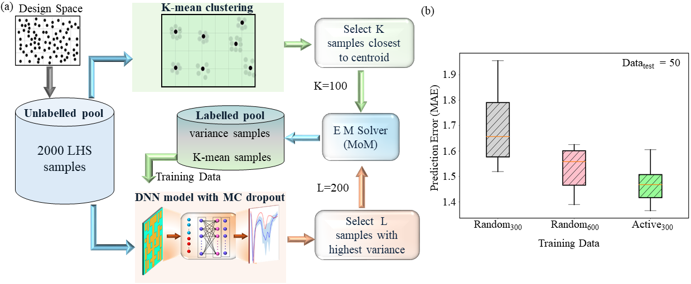

# Scalable Deep Bayesian Optimization for High-Dimensional Antenna Design

This repository contains the source code and supporting files for the work titled **"Scalable Deep Bayesian Optimization for High-Dimensional Antenna Design"**. The framework implements a deep neural network-based surrogate model with Monte Carlo (MC) dropout for uncertainty quantification, integrated within a Bayesian optimization (BO) loop tailored for antenna design problems with large design spaces and multi-output objectives.

---

## 🔍 Project Overview

Traditional BO approaches using Gaussian Process (GP) surrogates face scalability issues in high-dimensional and multi-output settings due to their cubic training complexity. This project overcomes such limitations by introducing:

- **DNN surrogate model** with MC Dropout for scalable Bayesian inference  
- **Active sampling strategy** for diverse and informative dataset initialization  
- **Hybrid acquisition strategy** using Expected Improvement (EI) with Differential Evolution (DE) for robust global search  

The framework is validated on a **52-variable tile-based UWB patch antenna**, demonstrating performance improvements over state-of-the-art GP-based methods (TRPBO, SADEA).

---

## 🔍 Active Learning Strategy

We employ a **three-step active sampling strategy** to construct an informative training dataset for the surrogate model:

1. **Diversity**: Generate a pool of 2000 design samples using **Latin Hypercube Sampling (LHS)** to ensure broad coverage of the design space.
2. **Representativeness**: Apply **k-means clustering** to select **K = 100** representative samples closest to cluster centroids for initial labeling.
3. **Informativeness**: Train a DNN with **Monte Carlo (MC) dropout** and iteratively select **L = 200** samples with the highest predictive variance for further labeling.

This approach ensures the surrogate is trained on samples that are diverse, representative, and informative—resulting in improved predictive performance compared to randomly selected datasets of similar size.

### Active Learning Workflow

*Figure 1: (a) Active learning strategy combining LHS, k-means clustering, and uncertainty sampling. (b) Prediction accuracy comparison between randomly sampled datasets (300 and 600 samples) and the
actively selected 300-sample dataset.*

## 📁 Repository Structure

scalable-deep-bayesian-optimization/
│
├── scalable_deep_Bayesian_Optimization.ipynb    # Main Jupyter notebook implementing the BO framework
├── Conv_DE.m                                    # MATLAB script for conventional Differential evolution (using true fitness evaluation)
├── GP_SADEA.m                                    # MATLAB script for SADEA baseline (GP-based surrogate)
├── GP_TRPBO.m                                    # MATLAB script for TRPBO baseline (GP-based surrogate)
├── README.md                                     # Project documentation

---

## ⚙️ System Requirements

- Python 3.8+
- PyTorch ≥ 1.10
- GPyTorch ≥ 1.7
- Optuna ≥ 3.0
- NumPy, SciPy, scikit-learn, Matplotlib, tqdm
- (Optional) CUDA-compatible GPU for faster model training
- compiler  gcc (conda-forge gcc 12.1.0-17) 12.1.0

